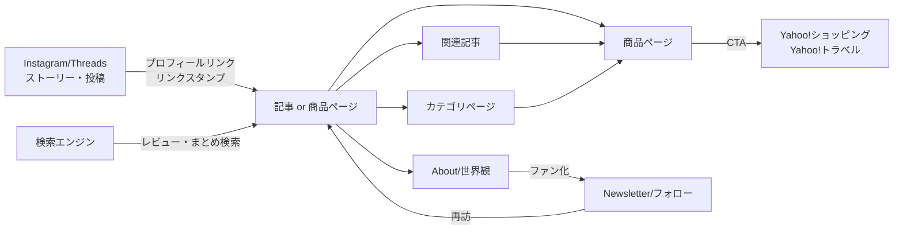

# 02. 情報設計(IA)・サイトマップ・URL設計

## 1. 情報設計の基本方針

1. **生活文脈で編む**: 一次分類は商品ジャンルではなく「生活のシーン」(旅・子育て・暮らし・コーヒー…)。無印良品的な分類思想。
2. **商品と記事は別エンティティ**: 商品=データベース的なストック(1商品1ページ)、記事=編集されたマガジンコンテンツ。相互リンクで回遊を作る。
3. **すべてのページはハブたりうる**: 検索・SNS・どこから着地しても、世界観(ブランド)と次のコンテンツへ2クリック以内で到達できる。
4. **URLは10年変えない**: slugは英語小文字ケバブケース。カテゴリ変更してもURLが壊れない構造にする(URLにカテゴリを含めない)。

## 2. サイトマップ

```
/                           トップ(Home)
├── /products/              商品一覧(全商品・フィルタ可)
│   └── /products/{slug}/   商品詳細
├── /articles/              記事一覧(全記事)
│   └── /articles/{slug}/   記事詳細(review/roundup/comparison/ranking/log 共通)
├── /categories/            カテゴリ一覧(インデックス)
│   └── /categories/{slug}/ カテゴリ別ページ(travel, parenting, living, daily-goods, coffee, appliances, photography)
├── /tags/{slug}/           タグ別一覧
├── /ranking/               総合ランキング(おすすめ度ベース+編集)
├── /favorites/             お気に入り(V2・localStorage)
├── /search/                検索(Pagefind UI)
├── /about/                 プロフィール・ブランド紹介
├── /newsletter/            ニュースレター登録(V2)
├── /privacy/               プライバシーポリシー
├── /disclosure/            アフィリエイト・PR表記ポリシー
├── /sitemap-index.xml      サイトマップ(自動生成)
├── /rss.xml                RSS(記事)(自動生成)
└── /404                    Not Found(検索とカテゴリへ誘導)
```

### URL設計ルール

| ルール | 例 | 理由 |
|---|---|---|
| 商品は `/products/{slug}/` 固定 | `/products/ballmuse-baby-monitor/` | カテゴリ変更でURL不変。リダイレクト管理不要 |
| 記事は `/articles/{slug}/` 固定 | `/articles/okinawa-family-trip-2026/` | 記事タイプ(review/ranking等)はURLに含めない。タイプ変更に強い |
| slugは英語・小文字・ハイフン | `morning-coffee-setup` | 国際化・可読性・共有時の見た目 |
| 末尾スラッシュあり統一 | — | Cloudflare Pagesのデフォルトと一致。正規化を一意に |
| 日付をURLに含めない | — | 古く見えない=資産価値の維持(Evergreen戦略) |

## 3. カテゴリ体系(一次分類)

カテゴリはデータ(`src/content/categories/`)として管理し、コード変更なしで追加・改名できる。初期セット:

| slug | 表示名 | 英語名(誌面用) | 含むもの |
|---|---|---|---|
| travel | 旅行 | Travel | 旅行記・宿・Yahoo!トラベル導線・旅グッズ |
| parenting | 子育て | Family | 育児用品・月齢別・子連れおでかけ |
| living | 暮らし | Living | インテリア・収納・家事 |
| daily-goods | 日用品 | Essentials | 消耗品・便利グッズ |
| appliances | 家電 | Appliances | 生活家電・ガジェット |
| coffee | コーヒー | Coffee | 器具・豆・ルーティン |
| photography | 写真 | Photography | 撮影記・機材(メインにしない。世界観の背骨として少数精鋭) |

補助分類:
- **タグ**(横断・自由): `#買ってよかった` `#出産準備` `#ふたり旅` `#朝の習慣` など。AIが生成し人間が承認。タグは乱立防止のため `src/content/tags/` に登録制。
- **コレクション**(編集特集): 「買ってよかった2026」「沖縄子連れ旅のすべて」など、記事タイプ`roundup`/`ranking`で表現(専用エンティティは作らない)。

## 4. コンテンツタイプ定義

| タイプ | 実体 | 目的 | 例 |
|---|---|---|---|
| product | 商品データ+ページ | ストック資産・アフィリエイトの着地点 | 「BALMUDA The Pot」 |
| article: review | 単商品の深掘り記事 | SEO(「◯◯ レビュー」)・商品ページより物語性 | 「3ヶ月使って分かったこと」 |
| article: roundup | まとめ記事 | SEO(「◯◯ おすすめ」)・複数商品への導線 | 「沖縄子連れ旅で持って行って良かったもの7つ」 |
| article: comparison | 比較記事 | 購買直前層の獲得 | 「AとB、うちが選んだ理由」 |
| article: ranking | ランキング記事 | 回遊ハブ・シェアされやすい | 「今年買って良かったもの Best 10」 |
| article: log | 記録(商品に必ずしも紐づかない) | 世界観・E-E-A-T・ファン化 | 「週末の過ごし方」「旅行記」 |
| sns-derivative | SNS派生コンテンツ(サイト非公開のデータ) | 各SNSへの配信素材 | リール台本・Threads文面 |

## 5. ナビゲーション設計

### グローバルナビゲーション(ヘッダー)
`ロゴ | Travel | Family | Living | Coffee | … (カテゴリ上位5つ) | Ranking | About | 検索アイコン`
- モバイル: ロゴ+検索+ハンバーガー(フルスクリーンオーバーレイメニュー)
- ヘッダーは常に白背景・細い下線のみ。スクロールで隠れ、上スクロールで再表示(視界の邪魔をしない)

### フッター
`ブランドステートメント / カテゴリ全一覧 / About / SNSリンク / Newsletter(V2) / Privacy / Disclosure / © LIFESTACK`

### パンくず
全下層ページに表示: `Home > カテゴリ > ページ名`。JSON-LD `BreadcrumbList` を出力。

### コンテキストナビゲーション(回遊の要)
- 商品ページ → 関連記事(この商品が登場する記事)・同カテゴリの商品・同タグ商品
- 記事ページ → 登場した商品カード・同カテゴリの記事・「次に読む」1本(編集指定 or 同カテゴリ最新)
- すべての一覧ページ末尾 → カテゴリ横断の「人気」セクション

## 6. 回遊モデル(IAレベルのUX)



設計原則: **入口はどこでもよいが、出口は必ず「Yahoo!へ」か「もう1本読む」か「フォローする」のいずれかに設計する**。行き止まりページを作らない。

## 7. コンテンツ間リレーション(IAレベル)

- 記事は本文中で商品を `productId` により参照する(埋め込みコンポーネント)。ビルド時に逆引きインデックスを生成し、商品ページに「この商品が登場する記事」を自動表示する。
- 「関連記事」の手動指定フィールド(`related`)も持ち、編集意図を優先、不足分は同カテゴリ・同タグから自動補完する。
- この双方向リンクグラフが「コンテンツ資産の複利」の実装形。詳細は [07-data-model.md](07-data-model.md)。
