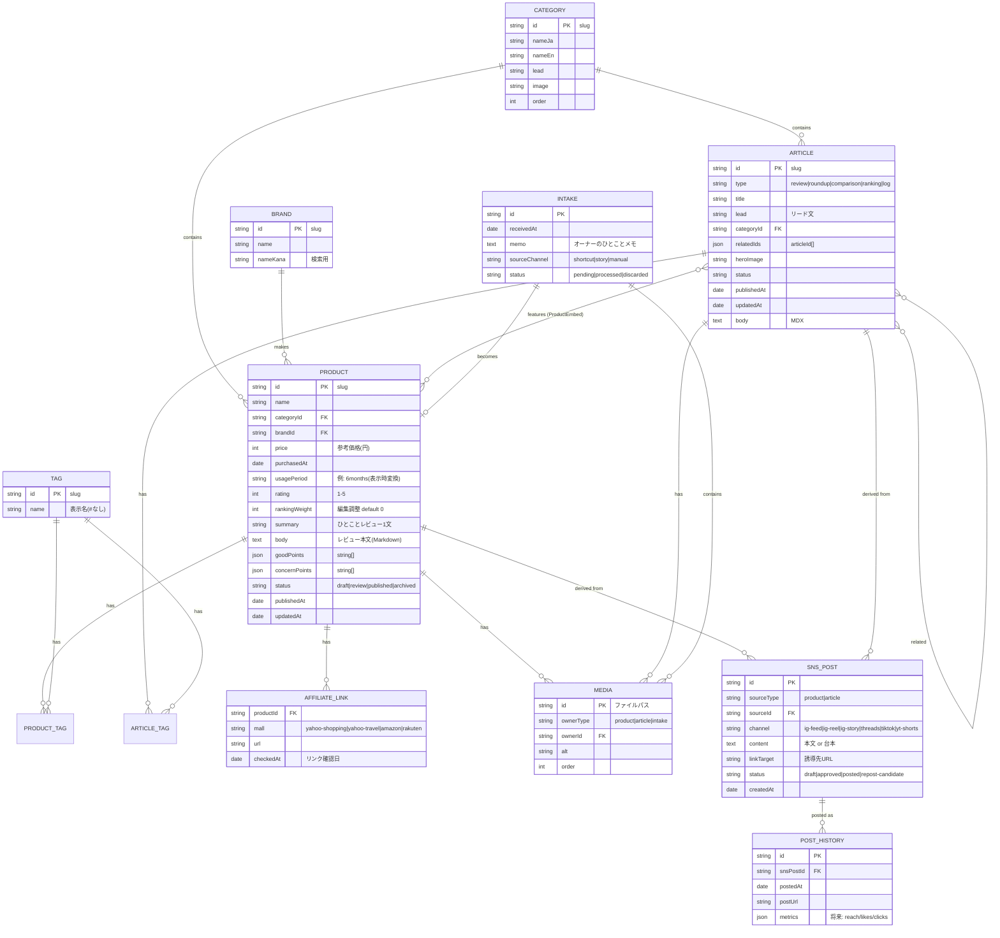

# 07. データモデル・ER図・スキーマ定義

## 1. 設計方針

- **物理実装はファイル**(Git as CMS): 商品=Markdown+frontmatter、分類=JSON。DBサーバーは持たない。
- ただし**論理モデルはRDB相当のER図で定義**し、V3以降で Cloudflare D1(SQLite)に分析系・履歴系だけを移す際も同じモデルを使う。
- スキーマは Astro Content Collections の **Zodスキーマが唯一の正**。ビルド時に全コンテンツを型検証し、不正データはビルド失敗させる(壊れたコンテンツが公開されない保証)。

## 2. ER図(論理モデル)



## 3. 物理実装マッピング

| 論理エンティティ | 物理実装(V1〜V2) | 将来(V3+) |
|---|---|---|
| PRODUCT | `src/content/products/{slug}.md`(frontmatter+本文) | 変更なし |
| ARTICLE | `src/content/articles/{slug}.mdx` | 変更なし |
| CATEGORY | `src/content/categories/{slug}.json` | 変更なし |
| BRAND | `src/content/brands/{slug}.json` | 変更なし |
| TAG | `src/content/tags/{slug}.json` | 変更なし |
| AFFILIATE_LINK | PRODUCT frontmatter内 `affiliate` オブジェクト(正規化しない: 1商品最大4リンクで十分) | 変更なし |
| MEDIA | `src/assets/products/{slug}/01.jpg` 命名規約+frontmatter `images[]`(alt必須) | R2検討 |
| SNS_POST | `content-hub/sns/{sourceId}/{channel}-{n}.md`(サイト非公開・同リポジトリ) | D1 |
| POST_HISTORY | `content-hub/history.jsonl`(追記型) | D1 |
| INTAKE | GitHub Issue(`intake` ラベル)→ 処理後クローズ | D1 |

- ARTICLE↔PRODUCT の「登場」関係はテーブルを持たず、**MDX内の `<ProductEmbed id="..."/>` をビルド時にパースして逆引きインデックスを生成**する(`src/lib/product-index.ts`)。編集の実態(本文に埋め込む)とデータが乖離しない。

## 4. Zodスキーマ定義(実装コードの正)

`src/content/config.ts` に実装する。Sonetはこれをそのまま書き起こすこと。

```ts
// products コレクション
const products = defineCollection({
  type: 'content',
  schema: ({ image }) => z.object({
    name: z.string().min(1).max(80),
    category: reference('categories'),
    brand: reference('brands').optional(),
    price: z.number().int().positive().optional(),      // 参考価格(円)
    purchasedAt: z.coerce.date(),
    usagePeriod: z.enum(['under1m','1-3m','3-6m','6-12m','over1y','over3y']),
    rating: z.number().int().min(1).max(5),
    rankingWeight: z.number().int().default(0),          // ランキング編集調整
    summary: z.string().max(60),                         // ひとことレビュー
    goodPoints: z.array(z.string().max(40)).min(1).max(5),
    concernPoints: z.array(z.string().max(40)).min(1).max(3), // 必須=正直さの担保
    scenes: z.array(z.object({                           // 使用シーン
      image: image(), alt: z.string(), caption: z.string().max(80),
    })).max(3).default([]),
    images: z.array(z.object({ src: image(), alt: z.string() })).min(1).max(6),
    tags: z.array(reference('tags')).max(8).default([]),
    affiliate: z.object({
      yahooShopping: z.object({ url: z.string().url(), checkedAt: z.coerce.date() }).optional(),
      yahooTravel:   z.object({ url: z.string().url(), checkedAt: z.coerce.date() }).optional(),
      amazon:        z.object({ url: z.string().url(), checkedAt: z.coerce.date() }).optional(), // V3
      rakuten:       z.object({ url: z.string().url(), checkedAt: z.coerce.date() }).optional(), // V3
    }).default({}),
    status: z.enum(['draft','review','published','archived']).default('draft'),
    publishedAt: z.coerce.date().optional(),
    updatedAt: z.coerce.date().optional(),
  }).refine(d => d.status !== 'published' || !!d.publishedAt,
    { message: 'published には publishedAt が必須' }),
});

// articles コレクション
const articles = defineCollection({
  type: 'content', // MDX
  schema: ({ image }) => z.object({
    type: z.enum(['review','roundup','comparison','ranking','log']),
    title: z.string().min(1).max(60),                    // SEO: 60字以内
    lead: z.string().max(120),
    category: reference('categories'),
    heroImage: image(),
    heroAlt: z.string(),
    tags: z.array(reference('tags')).max(8).default([]),
    related: z.array(reference('articles')).max(3).default([]),
    seo: z.object({
      description: z.string().max(120).optional(),       // 未指定時leadを使用
      noindex: z.boolean().default(false),
    }).default({}),
    status: z.enum(['draft','review','published','archived']).default('draft'),
    publishedAt: z.coerce.date().optional(),
    updatedAt: z.coerce.date().optional(),
  }),
});

// categories / brands / tags(data コレクション)
const categories = defineCollection({ type: 'data', schema: ({ image }) => z.object({
  nameJa: z.string(), nameEn: z.string(), lead: z.string().max(100),
  image: image(), order: z.number().int(),
})});
const brands = defineCollection({ type: 'data', schema: z.object({
  name: z.string(), nameKana: z.string().optional(), url: z.string().url().optional(),
})});
const tags = defineCollection({ type: 'data', schema: z.object({ name: z.string() })});
```

補足規則:
- `status: published` 以外はビルド出力から除外(`getCollection` のfilterで一元処理 → `src/lib/content.ts` の `getPublished()`)。
- draft/review はプレビュー環境(Cloudflare Pages preview branch)でのみ出力(`import.meta.env.PREVIEW` 判定)。
- `usagePeriod` の表示変換(`3-6m` → 「使用3〜6ヶ月」)は `src/lib/format.ts`。

## 5. サイト設定データ

`src/content/site.json`(単一ファイル・Zod検証):

```
siteName, tagline, taglineEn, description, url,
heroImage, heroAlt,
author: { name, bio, image },
sns: { instagramPhoto, instagramHome, youtube, tiktok, threads },
newsletterUrl(V2), contactEmail,
editorsPicks: productId[](トップ③の手動選定),
pinned: { [categoryId]: articleId }(カテゴリ特集の手動選定)
```

サイト名変更・Hero差し替え・おすすめ入れ替えはこのファイル1つの編集で完結する。

## 6. content-hub(SNS派生コンテンツ)スキーマ(V2)

サイトに公開されないが同一リポジトリで資産管理する。

```
content-hub/
├── sns/{productId or articleId}/
│   ├── ig-feed-1.md        # frontmatter: channel, status, linkTarget, hashtags[]
│   ├── ig-reel-1.md        # 本文=台本(シーン/セリフ/テロップ/使用写真の指定)
│   ├── ig-story-1.md
│   ├── threads-1.md
│   ├── tiktok-1.md
│   └── yt-shorts-1.md
├── history.jsonl           # {id, snsPostId, postedAt, channel, postUrl}
└── repost-queue.json       # 再投稿候補 {snsPostId, reason, suggestedAt}[]
```

frontmatter共通: `channel / sourceType / sourceId / status(draft|approved|posted|repost-candidate) / linkTarget / createdAt`。
再投稿候補ルール(V3自動化): 投稿から90日経過 & 季節タグ一致 & 過去メトリクス上位、をスコアリングして `repost-queue.json` に追記。

## 7. データ整合性ルール(ビルド時検証)

1. `ProductEmbed` の productId が実在しない → **ビルドエラー**
2. published商品に画像0枚/alt欠落 → **ビルドエラー**(Zodで保証)
3. affiliate URL未設定のpublished商品 → **警告ログ**(ボタン非表示で公開は可)
4. `checkedAt` が180日超のaffiliateリンク → **警告ログ**(リンク切れ点検の促し)
5. 孤立コンテンツ(どこからもリンクされない記事)→ **警告ログ**(回遊設計の担保)
