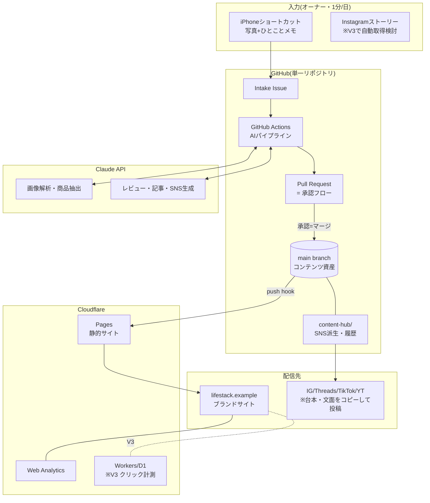

# 08. 技術選定・アーキテクチャ・ディレクトリ構成

## 1. 技術選定(比較と決定)

### 1.1 サイトフレームワーク

| 候補 | 強み | 弱み | 判定 |
|---|---|---|---|
| **Astro** ✅ | コンテンツ特化(Content Collections+Zod)。デフォルトJSゼロ=速度最強。画像最適化内蔵。MDX。島アーキテクチャで必要箇所だけJS。Cloudflare Pages公式サポート | エコシステムはNextより小さい | **採用** |
| Next.js (SSG) | エコシステム最大。将来のアプリ化に強い | コンテンツサイトには過剰。デフォルトでReactランタイム(~90KB)を全ページ配布。静的画像最適化が弱い(export時) | 不採用 |
| Hugo | ビルド最速 | テンプレート言語(Go template)がAI生成・保守と相性が悪い。コンポーネント設計が貧弱 | 不採用 |
| Eleventy | 軽量・自由 | スキーマ型検証・画像最適化・島アーキテクチャを自前で組む必要 | 不採用 |
| WordPress | 実績 | 保守・速度・セキュリティ・世界観の全てで本プロジェクトの思想に反する | 不採用 |

**決定理由の核心**: 本プロジェクトは「コンテンツ(Markdown)を型検証して美しく静的配信する」ことが9割。Astroはこの9割が標準機能であり、AIエージェントが生成・保守するコードとしても構造が単純(=5年保守できる)。

### 1.2 スタイリング

| 候補 | 判定 | 理由 |
|---|---|---|
| **素のCSS(CSS Custom Properties+ネスト+レイヤー)** ✅ | **採用** | デザイントークン駆動と最も素直に整合。依存ゼロ=5年後も動く。Astroのscoped styleで十分な分離が得られる |
| Tailwind CSS | 不採用(次点) | 速度は出るが、トークンとの二重管理・クラス列がAI保守時のdiffを汚す。誌面的な細かい組版制御は素CSSが勝る |
| CSS-in-JS | 不採用 | ランタイムコスト。静的サイトの思想に反する |

### 1.3 検索

| 候補 | 判定 | 理由 |
|---|---|---|
| **Pagefind** ✅ | **採用** | ビルド時インデックス生成・サーバー不要・日本語対応・無料。静的サイトの思想に完全一致 |
| Algolia | 不採用 | 月額・外部依存。この規模には過剰 |
| 自前JSON+Fuse.js | 不採用 | コンテンツ増でインデックス肥大。Pagefindはチャンク分割配信で解決済み |

### 1.4 ホスティング・CI/CD

- **Cloudflare Pages**(要件指定・妥当): 無料枠で十分、グローバルCDN、preview deployments(PRごとのプレビューURL=承認フローと相性◎)、将来Workers/D1/R2への拡張が同一プラットフォーム。
- **GitHub**: コード+コンテンツの単一リポジトリ。GitHub ActionsはAIパイプライン実行基盤(V2)。
- デプロイ: `git push` → Cloudflare Pages自動ビルド(`astro build`)→ 本番。PRブランチ → プレビューURL。

### 1.5 AI・自動化(V2以降)

| 用途 | 選定 | 理由 |
|---|---|---|
| テキスト生成(レビュー・記事・SNS) | Claude API(Sonnetクラス) | 日本語の自然さ・長文構成力・指示追従。コスト/品質バランス |
| 画像解析(商品特定・alt生成) | Claude API(vision) | テキスト生成と同一APIで完結。OCR含む |
| 実行基盤 | GitHub Actions | 無料枠潤沢・Secrets管理・成果物をそのままPRにできる |
| 入稿 | iPhoneショートカット → GitHub API(Issue作成+画像添付) | 追加アプリ不要。オーナーの手数最小 |
| 承認UI | GitHub PR(モバイルはGitHubアプリ) | 専用管理画面を作らない=保守ゼロ。差分・履歴・ロールバックが標準装備 |

### 1.6 計測

- V1: **Cloudflare Web Analytics**(cookieless・無料・同意バナー不要)+ Yahoo!アフィリエイト管理画面レポート + Google Search Console。
- V3: Cloudflare Workers によるアフィリエイトクリック計測(`/go/{productId}/{mall}?pos=` リダイレクタ)+ D1蓄積。※V1からリンクは `AffiliateButton` に集約してあるため、後からリダイレクタ差し替えは1コンポーネントの変更で済む。

## 2. システム構成図



## 3. ディレクトリ構成

```
lifestack/
├── astro.config.mjs              # Astro設定(sitemap, mdx, pagefind統合)
├── package.json
├── tsconfig.json
├── public/
│   ├── favicon.svg
│   ├── manifest.webmanifest      # PWA(A-12)
│   ├── icons/                    # PWAアイコン・apple-touch-icon
│   └── fonts/                    # サブセット済みセルフホストフォント
├── src/
│   ├── content/
│   │   ├── config.ts             # ★Zodスキーマ(07章)。データ設計の正
│   │   ├── site.json             # サイト設定(名称・Hero・SNS・editorsPicks)
│   │   ├── products/             # 商品 {slug}.md
│   │   ├── articles/             # 記事 {slug}.mdx
│   │   ├── categories/           # {slug}.json
│   │   ├── brands/               # {slug}.json
│   │   ├── tags/                 # {slug}.json
│   │   └── brand/
│   │       └── voice.md          # ボイス&トーン(AIプロンプト共通参照)
│   ├── assets/
│   │   ├── products/{slug}/      # 商品写真(01.jpg, 02.jpg...)
│   │   ├── articles/{slug}/
│   │   └── site/                 # Hero・About写真
│   ├── components/
│   │   ├── base/                 # Button, TagChip, RatingStars, Icon, ...
│   │   ├── content/              # ProductCard, ArticleCard, ProductEmbed, ...
│   │   ├── section/              # Hero, CategoryBand, RankingList, ...
│   │   ├── island/               # SearchPage, MobileMenu, Gallery, FavoriteButton
│   │   └── layout/               # Header, Footer
│   ├── layouts/
│   │   ├── BaseLayout.astro
│   │   ├── ProductLayout.astro
│   │   ├── ArticleLayout.astro
│   │   └── TextPageLayout.astro  # privacy/disclosure用
│   ├── pages/
│   │   ├── index.astro
│   │   ├── products/[...slug].astro
│   │   ├── products/index.astro
│   │   ├── articles/[...slug].astro
│   │   ├── articles/index.astro
│   │   ├── categories/[slug].astro
│   │   ├── categories/index.astro
│   │   ├── tags/[slug].astro
│   │   ├── ranking.astro
│   │   ├── search.astro
│   │   ├── favorites.astro       # V2
│   │   ├── about.astro
│   │   ├── privacy.astro
│   │   ├── disclosure.astro
│   │   ├── 404.astro
│   │   ├── rss.xml.ts
│   │   ├── og/[...slug].png.ts   # OG画像自動生成(satori)
│   │   └── api/products-index.json.ts  # 静的JSON(お気に入り用)
│   ├── lib/
│   │   ├── content.ts            # getPublished() 等の取得ユーティリティ
│   │   ├── related.ts            # 関連コンテンツ解決ロジック
│   │   ├── product-index.ts      # ProductEmbed逆引きインデックス
│   │   ├── ranking.ts            # ランキング算出
│   │   ├── format.ts             # 日付・価格・使用期間の表示変換
│   │   ├── seo.ts                # JSON-LD生成(Product/Article/Breadcrumb)
│   │   └── affiliate.ts          # モール→URL/ラベル解決・計測パラメータ付与
│   └── styles/
│       ├── tokens.css            # ★デザイントークン(03章)。デザインの正
│       ├── global.css            # reset+base+ユーティリティ最小
│       └── prose.css             # 記事本文タイポグラフィ
├── content-hub/                  # V2: SNS派生・履歴(サイト非公開)
│   ├── sns/
│   ├── history.jsonl
│   └── repost-queue.json
├── pipeline/                     # V2: AIパイプライン(09章)
│   ├── prompts/                  # 生成プロンプトテンプレート
│   └── scripts/                  # intake処理・生成・PR作成スクリプト
├── .github/
│   └── workflows/
│       ├── ci.yml                # ビルド検証+整合性チェック(07章§7)
│       └── generate.yml          # V2: intake→AI生成→PR
└── docs/                         # 本設計書
```

設計上の要点:
- **「正」が3つだけ**: データの正=`content/config.ts`、デザインの正=`styles/tokens.css`、文体の正=`content/brand/voice.md`。他はすべて派生。
- ページとロジックを分離(`pages/` は取得と組み立てのみ、計算は `lib/`)。AI保守時に影響範囲が読める。
- `content-hub/` と `pipeline/` はサイトビルドから完全独立(astro.configで無視)。V2追加時にサイト側の変更ゼロ。

## 4. ビルド・デプロイ仕様

| 項目 | 内容 |
|---|---|
| ビルド | `astro build` → `dist/`。Pagefindはpostbuildでインデックス生成(`pagefind --site dist`) |
| 画像 | Astro `<Image>`: AVIF/WebP+width srcset自動生成。Hero系のみ `priority` |
| OG画像 | `satori` + `sharp` でビルド時生成(タイトル+写真+ロゴの定型デザイン)。全記事・全商品分 |
| Cloudflare Pages設定 | Build command: `npm run build` / Output: `dist` / Node 22 |
| プレビュー | 全ブランチ自動プレビュー。`PREVIEW=true` 環境変数で draft/review コンテンツも出力 |
| CI(GitHub Actions) | PR時: build成功+リンク整合性チェック(07章§7)+Lighthouse CI(閾値95) |
| キャッシュ | HTMLは `max-age=0, must-revalidate`、アセットはハッシュ付きファイル名で `immutable` |

## 5. 将来拡張の受け口(5年設計)

| 将来要件 | 受け口(現設計に織り込み済み) |
|---|---|
| Amazon/楽天追加 | `affiliate` スキーマに定義済み。AffiliateButtonのmall mapに2行追加 |
| クリック計測 | AffiliateButton一元化 → `/go/` リダイレクタ(Workers)への差し替えは1箇所 |
| D1移行(履歴・分析) | 論理ERモデル定義済み(07章)。content-hubのJSONL→D1インポートは機械的 |
| 多言語化 | URL設計がslug英語・カテゴリdata駆動のため `/en/` プレフィックス追加で対応可能 |
| ダークモード | 全色がトークン参照のため tokens.css に1ブロック追加 |
| ヘッドレスCMS化 | コンテンツはZodスキーマ準拠のMarkdown → 任意のCMSからエクスポート可能な標準形 |
