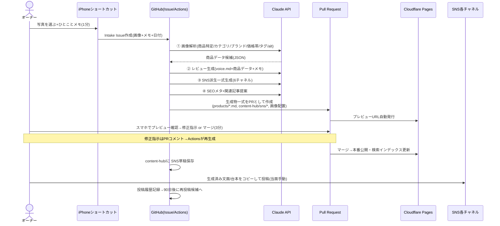

# 09. AIコンテンツ生成パイプライン設計(V2〜)

## 1. 思想

- 入力は「写真数枚+ひとことメモ」まで軽くする(オーナーの作業=1分)。
- 出力は**必ず人間の承認(PRマージ)を経て公開**される。AIは編集部、オーナーは編集長。
- 生成物はすべてGit管理=資産。同じ商品から何度でも再生成・再利用できる。
- プロンプトはコードと同様にバージョン管理(`pipeline/prompts/`)し、文体の正は `content/brand/voice.md` を常に注入。

## 2. エンドツーエンドのワークフロー



オーナーの総作業時間: **1商品あたり約4分**(入力1分+承認3分)。それ以外はすべて自動。

## 3. 入稿(Intake)仕様

### iPhoneショートカット「LIFESTACKに送る」
1. 写真ピッカー(1〜6枚。ストーリーに使った写真をそのまま選ぶ)
2. テキスト入力プロンプト: 「ひとことメモ(例: 沖縄で使った子供用の水筒。軽くて漏れない。3,000円くらい)」
3. GitHub REST APIで Issue 作成: タイトル=メモ先頭20字、本文=メモ+撮影日+画像(base64→issueに添付)、ラベル `intake`
4. 完了通知「受け付けました。生成が終わるとPRが届きます」

- 認証: Fine-grained PAT(Issues: write のみ)をショートカットに保存。
- 旅行(ホテル)の場合: メモに「宿」と書けばAIが `yahoo-travel` 系として処理(カテゴリ=travel、YahooトラベルURL枠を用意)。

### 代替入力(同じIssueフォーマットに正規化)
- GitHub Issueを直接手書き(PC作業時)
- V3: Instagram Graph APIでストーリーを日次取得 → 未処理分をIntake Issue化(要ビジネスアカウント+アプリ審査。実現性を検証の上)

## 4. 生成ステージ定義

GitHub Actions `generate.yml`(trigger: issues labeled `intake`)。各ステージは `pipeline/scripts/` のNode/TSスクリプト。

### Stage 1: 解析(analyze)
- 入力: 画像(vision)+メモ
- 出力(JSON): `{ name候補, brand候補, category, price推定, tags候補[], 画像ごとのalt, 確信度 }`
- 確信度が低い項目は `TODO:` マーカー付きでPRに含め、人間が承認時に埋める(空欄のまま公開されない仕組みはZodが保証)

### Stage 2: 商品レビュー生成(compose-product)
- 入力: Stage1のJSON+メモ+`voice.md`+既存の同カテゴリレビュー2本(文体の一貫性のためのfew-shot)
- 出力: `src/content/products/{slug}.md` 一式(frontmatter完全体+本文)
- 制約: `concernPoints` を最低1つ必ず生成(なければ「まだ見つかっていない」と書かずにPRコメントで人間に確認を求める)。**事実の捏造禁止**: メモ・画像から読み取れない体験談は書かず、`<!-- CONFIRM: -->` コメントで確認を求める

### Stage 3: 記事判断(editorial-judge)
- この商品で単独レビュー記事を書くべきか、既存のroundup記事に追記すべきか、記事化見送りかをAIが提案(PR説明文に理由付きで記載)。記事生成は提案が承認された場合に別PRで実行

### Stage 4: SNS派生生成(derive-sns)
- 出力: `content-hub/sns/{productId}/` に6ファイル

| チャネル | 生成内容 |
|---|---|
| ig-feed | キャプション(冒頭1行フック+本文+定型導線+ハッシュタグ15個) |
| ig-reel | 台本(6〜9シーン: 使用写真指定/テロップ/ナレーション/尺) |
| ig-story | 3枚構成案(写真指定+スタンプ/リンク位置+文言) |
| threads | 250字の投稿文+サイトURL |
| tiktok | 台本(フック3秒/展開/オチ/概要欄文面) |
| yt-shorts | 台本(tiktokの派生+タイトル/説明欄/タグ) |

### Stage 5: SEO(seo-meta)
- title(32字以内)/description(120字以内)/JSON-LD検証/内部リンク提案(既存記事から3件)を生成しfrontmatter・PR説明に反映

### Stage 6: PR作成(open-pr)
- ブランチ `content/{intake-id}-{slug}`、PRテンプレートに: プレビューURL・生成サマリ・確認チェックリスト(名称正しい?/価格OK?/気になった点は本心?/アフィリエイトURL貼った?)
- **アフィリエイトURLだけは人間が貼る**(Yahoo!の規約上、リンク生成は本人の管理画面から行うのが安全)。PRのTODOチェックボックスで促す

## 5. プロンプト設計原則(`pipeline/prompts/`)

各プロンプトはMarkdownテンプレート(変数は `{{mustache}}`)。共通構造:

```
1. 役割定義(あなたはLIFESTACK編集部のライター)
2. voice.md 全文(文体の正)
3. 禁止事項(誇張語/捏造/絵文字規定/PR表記関連の断定)
4. 入力データ(商品JSON/メモ/画像解析結果)
5. few-shot(既存の良質コンテンツ2本)
6. 出力フォーマット(frontmatter含む完全なファイル内容。JSONスキーマ指定)
7. 自己検証指示(出力前にZodスキーマ相当のチェックリストで自己点検)
```

- モデル指定・温度等は `pipeline/config.json` に集約(モデル更新が1箇所)。
- 生成コスト目安: 1商品フルセット(全ステージ)≒ 数十円。月30商品でも月$5前後。

## 6. 再投稿・再利用エンジン(V3)

- `content-hub/history.jsonl` + `repost-queue.json` を毎週月曜のActionsが走査:
  1. 投稿から90日以上経過した高評価コンテンツ
  2. 季節一致(タグ×月のマッピング: 「水筒」→5〜7月等。AIが判定)
  3. サイト側で人気(V3のクリック計測データ)
- 上位5件を「今週の再投稿候補」としてIssue化(文面は角度を変えてAIが再生成: 同じ商品でも「半年使った続報」など)。オーナーはコピーして投稿するだけ。

## 7. 品質・安全ガードレール

| リスク | 対策 |
|---|---|
| AIの事実捏造 | 体験談はメモ由来のみ。不明点は `CONFIRM` マーカー+PRチェックリスト |
| ステマ規制違反 | PR表記はテンプレート強制(コンポーネントに組込み・AI生成物に依存しない) |
| 文体の劣化・ドリフト | voice.md注入+few-shot+月1回のサンプル抜き打ちレビュー |
| プロンプトインジェクション(メモ経由) | intakeメモはデータとして扱い、プロンプト内で明示的にデリミタ分離 |
| API障害・生成失敗 | ActionsはリトライしIssueにエラーコメント。intakeは失われない(Issueが残る) |
| 全自動公開の事故 | 存在しない(公開は常にPRマージ=人間の操作) |
